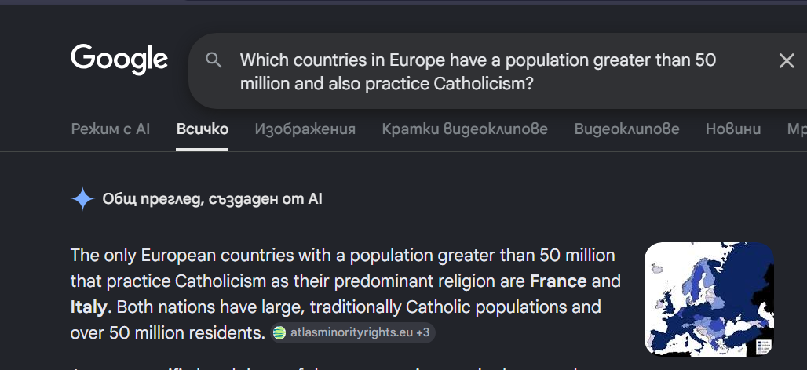

# Geographic Ontology NLQ Tester

A research project exploring whether a small local LLM can reliably translate natural language questions into SPARQL queries over an OWL2 ontology. Questions are answered by querying a geographic knowledge graph in GraphDB; results are scored against reference queries run live against the triplestore.

Built as part of a Master's course in Knowledge Representation at Sofia University.

> A detailed research report covering methodology, ontology design, and full benchmark analysis is available in [report.md](docs/report.md).

---



*Query result verified against real-world data — France and Italy are the Catholic countries in Europe with a population above 50 million (Google AI Search, July 2026)*

---

## How It Works

```
Natural language question
         │
         ▼
   LLM via Ollama  ◄── system prompt: full ontology schema + 11 SPARQL generation rules
         │          ◄── 7 few-shot examples (one per SPARQL construct)
         ▼
   SPARQL query
         │
         ▼
  GraphDB (OWL2-RL) ── transitive closure of is_located_in materialised at import time
         │           ── defined classes (Megacity, CapitalCity, RepublicState, …) resolved
         ▼
    Result set
         │
         ▼
  Score vs. reference ── EXACT / PARTIAL / NONE
```

The reference answer for each question is a hand-written SPARQL query executed live against GraphDB at test time — there are no hardcoded expected values.

---

## Benchmark Results

22 questions across 7 categories, 10 runs each. Accuracy = percentage of exact result-set matches.

| Cat | Category | `qwen2.5-coder:3b` | `qwen2.5-coder:7b` |
|-----|----------|:------------------:|:------------------:|
| 1 | Direct Retrieval | **100%** | 97% |
| 2 | Transitivity | **100%** | **100%** |
| 3 | Numeric Filter | **100%** | 80% |
| 4 | Defined Class | 73% | **90%** |
| 5 | Aggregation | 68% | **98%** |
| 6 | Compositional | 57% | **100%** |
| 7 | Reasoning Required | 57% | **83%** |
| | **Overall** | **79%** (173/220) | **93%** (204/220) |

The 3B model outperforms the 7B on simple retrieval and numeric filters; the 7B model is substantially better on aggregation, compositional queries, and reasoning.

### Known Failure Modes

| Question | 3B | 7B | Root cause |
|----------|:--:|:--:|------------|
| Q8 — cities pop > 1M | 100% | 40% | 7B regression: uses `geo:population > N` as a property triple instead of `FILTER` |
| Q12 — Sunni Islamic countries | 40% | 70% | Both models attempt `a geo:SunniIslamicCountry` — class has no materialised instances under OWL2-RL |
| Q14 — MAX peak height | 60% | 100% | 3B wraps height in `OPTIONAL` → `MAX` over unbound variable → no results |
| Q19 — capital cities not megacities | 30% | 100% | 3B abandons `MINUS`; some runs generate completely unrelated queries |
| Q21 — countries in North America | 0% | 100% | 3B consistently abbreviates `North_America` → `N_America` (9/10 runs) |
| Q22 — republics | 70% | 50% | 3B uses `RepublicState` as a property value; 7B produces structural errors (pipe syntax, `AND` conjunction) |

---

## Prerequisites

### 1. Python 3.10+

Download from [python.org](https://www.python.org/downloads/). Verify with:

```
python --version
```

### 2. GraphDB Free

1. Download and install [GraphDB Free](https://www.ontotext.com/products/graphdb/graphdb-free/).
2. Start GraphDB — it must be listening on **port 7200**.
3. Open the Workbench at `http://localhost:7200`.
4. Create a repository:
   - Setup → Repositories → Create new repository
   - Type: **GraphDB Repository**
   - Repository ID: **`geo`**
   - Ruleset: **OWL2-RL** (materialises defined classes like `Megacity`, `CapitalCity`, `RepublicState`, etc.)
   - Entity ID size: **40** (handles large ontologies without hash collisions)
   - Leave all other settings at their defaults, then click **Create**.
5. Import the OWL file:
   - Import → RDF → Upload local files
   - Select `data/GeoOntology.owl`
   - Click **Import** and confirm with the default settings (imports into the default graph).
6. Verify reasoning is active: after import, the Explore tab should show instances of `geo:Megacity`, `geo:CapitalCity`, `geo:RepublicState`, etc.

### 3. Ollama

1. Download and install [Ollama](https://ollama.com/).
2. Start Ollama — it must be listening on **port 11434**.
3. Pull the model(s) you intend to use:
   ```
   ollama pull qwen2.5-coder:3b
   ollama pull qwen2.5-coder:7b
   ```

---

## Setup

```powershell
# 1. Clone / extract the project, then open a terminal in the project folder.

# 2. Create a virtual environment
python -m venv venv

# 3. Activate it (PowerShell)
venv\Scripts\Activate.ps1

# If execution policy blocks the script, run once:
#   Set-ExecutionPolicy -Scope CurrentUser RemoteSigned

# 4. Install dependencies
pip install -r requirements.txt
```

---

## Running

Make sure GraphDB and Ollama are running, then:

```powershell
# Activate the venv if not already active
venv\Scripts\Activate.ps1

python main.py
```

The interactive menu offers four options:

| Key | Action |
|-----|--------|
| `S` | Run a single reference question with full output (LLM SPARQL, results, reference, match label) |
| `F` | Ask a free-form natural language question and see the SPARQL and results |
| `B` | Benchmark mode — runs questions N times silently, reports per-category and overall accuracy |
| `Q` | Quit |

### Benchmark mode

After selecting `B`, you will be prompted for:

1. **Scope** — `S` single reference question, `C` one category, `A` all 22 questions
2. **Runs** — number of repetitions (default: 10)
3. **Output mode**:
   - `P` — progress only: one line per run showing exact matches (default)
   - `F` — failure patterns: after the summary, prints every unique failing SPARQL per question with its count and LLM vs. reference results
   - `V` — verbose: one result line per question per run

---

## Selecting a Model

The default model is `qwen2.5-coder:3b` (faster, lower accuracy). To override it for a single run, use the `--model` flag:

```powershell
python main.py --model 3b   # qwen2.5-coder:3b — faster, lower accuracy (default)
python main.py --model 7b   # qwen2.5-coder:7b — slower, higher accuracy
python main.py --model qwen2.5-coder:7b  # full Ollama model name also accepted
```

To change the persistent default, edit `config.py`:

```python
OLLAMA_MODEL = "qwen2.5-coder:3b"   # change this line
```

---

## Project Structure

| File | Purpose |
|------|---------|
| `config.py` | Ollama URL, model name, GraphDB endpoint — single source of truth |
| `ontology_schema.py` | Full ontology schema (class hierarchy, properties, named individuals) + 11 SPARQL generation rules; included as the system prompt in every LLM call |
| `few_shot_prompt.py` | 7 few-shot examples (one per core SPARQL construct); assembles system + few-shot + user message list |
| `llm.py` | POSTs to Ollama `/api/chat`, extracts SPARQL from the response; `fix()` retries on syntax errors |
| `graphdb.py` | POSTs SPARQL to GraphDB, parses SPARQL 1.1 JSON results, strips the geo namespace from URIs |
| `reference_questions.py` | 22 reference test questions across 7 categories; reference SPARQL is executed live against GraphDB at test time — no hardcoded expected results |
| `runner.py` | Execution core: retry logic, scoring, single-question and free-form runners, question selection |
| `benchmark.py` | Batch benchmark runner, per-category statistics, failure pattern display |
| `main.py` | Entry point: CLI argument parsing, startup checks, interactive menu |
| `data/GeoOntology.owl` | The OWL2 geographic ontology loaded into GraphDB |
| `data/geo_project.py` | Script used to generate the ontology (owlready2) |

---

## Test Categories and Questions

| Cat | Name | Q# | What it tests |
|-----|------|----|---------------|
| 1 | Direct Retrieval | Q1–Q3 | Single-hop property reads: form of government, population, head of state |
| 2 | Transitivity | Q4–Q6 | `is_located_in` with OWL2-RL transitive closure (mountains in Asia, peaks in Europe, cities in South America) |
| 3 | Numeric Filter | Q7–Q9 | `FILTER` with `>`, `<`, and combined `&&` conditions on height and population |
| 4 | Defined Class | Q10–Q12 | OWL2-RL materialised classes: `Megacity`, `CapitalCity`; and `FILTER EXISTS` workaround for `SunniIslamicCountry` |
| 5 | Aggregation | Q13–Q16 | `COUNT`, `MAX`, `MIN`, `AVG` with `AS ?alias` |
| 6 | Compositional | Q17–Q19 | `UNION` (mountains or volcanoes), `OPTIONAL` (countries + religion), `MINUS` (capital cities not megacities) |
| 7 | Reasoning Required | Q20–Q22 | `FILTER NOT EXISTS` on transitive location (volcanoes not in Europe); named individual spelling (`North_America`); `FILTER IN` on form of government (republics) |

---

## How Scoring Works

Each run of a question is scored by comparing the LLM result set against the reference result set:

| Label | Meaning |
|-------|---------|
| `EXACT` | LLM result set equals the reference result set exactly |
| `PARTIAL` | Sets overlap but are not equal — shows how many correct values out of how many expected |
| `NONE` | No overlap between LLM results and reference results |
| `EXTRACTION FAILED` | LLM response contained no SPARQL code block |

Benchmark accuracy is reported as the percentage of `EXACT` matches.

---

## Syntax Retry

On an HTTP 400 response from GraphDB (malformed SPARQL), the app automatically asks the LLM to fix the query and retries up to **2 times**. Retries do not trigger on semantic errors (e.g., empty result sets). The total retry count is reported at the end of each benchmark run.

---

## Notes

- The ontology is a deliberately simplified model built for research purposes — it does not aim to be a complete geographic database. Results reflect only the data included in `GeoOntology.owl`. For example, only three volcanoes are modelled (Etna, Vesuvius, Mount Fuji), so a query for "volcanoes not in Europe" returns only Mount Fuji — not because it is the only such volcano in the world, but because it is the only one in the ontology.
- Benchmark results vary between runs due to LLM non-determinism. Use benchmark mode with at least 10 runs for reliable accuracy statistics.
- `is_located_in` is transitive — OWL2-RL materialises the full closure, so a query for `geo:is_located_in geo:Asia` correctly returns entities in countries that are themselves in Asia.
- Classes like `EuropeanCountry` and `LandlockedCountry` are defined in the ontology but have **no materialised instances** under OWL2-RL. Always use `geo:is_located_in geo:Europe` for location queries.
- `SunniIslamicCountry` similarly has no materialised instances; queries for it use `FILTER EXISTS { ?c geo:has_main_religion geo:Islam_Sunni }` instead.

---

## Acknowledgements

- The geographic OWL2 ontology was developed in collaboration with [@Bifrost19](https://github.com/Bifrost19).
- The `.gitignore` is based on the Python template from [github/gitignore](https://github.com/github/gitignore).
